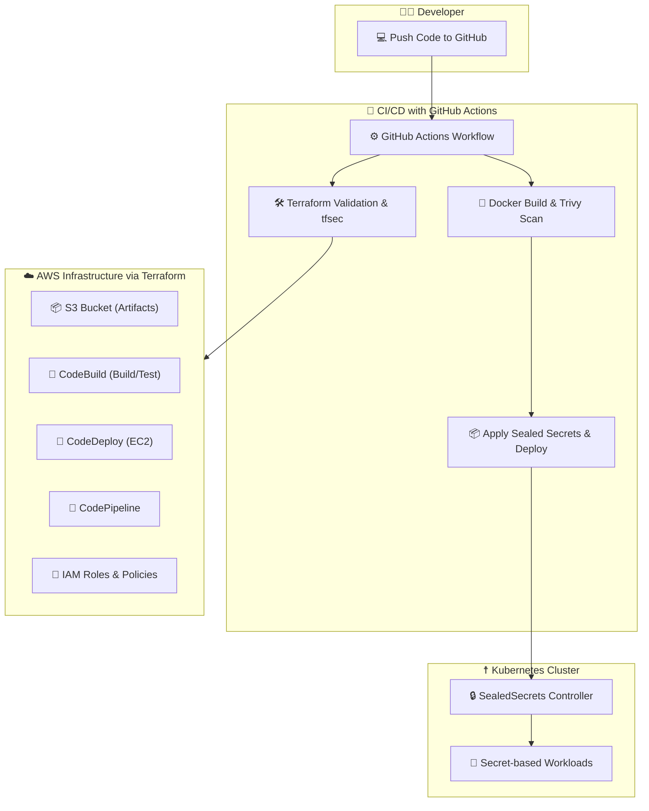

# 🚀 DevSecOps Project with Terraform, GitHub Actions, Docker & Kubernetes

This project demonstrates a complete **DevSecOps pipeline** using **Terraform**, **GitHub Actions**, **AWS**, **Docker**, and **Kubernetes**, with an emphasis on **Security**, **Automation**, and **Scalability**.

---

## 📊 Architecture Diagram


---

## 📌 Features

| Component        | Details                                                               |
| ---------------- | --------------------------------------------------------------------- |
| ⚙️ Architecture  | Microservices-oriented, automated CI/CD using GitHub Actions          |
| ☁️ AWS Infra     | S3, EC2, CodeBuild, CodeDeploy, CodePipeline, IAM                     |
| 🐳 Docker        | Containerized Node.js application with Docker                         |
| 🔐 Security      | tfsec (Terraform security), Trivy (Docker image scan), Sealed Secrets |
| 📄 Documentation | Complete infrastructure as code and CI/CD documentation               |

---

## 🧱 Tech Stack

- **Terraform**: Infrastructure provisioning (S3, EC2, IAM, Code\* services)
- **GitHub Actions**: CI/CD automation
- **Docker**: Containerization
- **Trivy**: Docker vulnerability scanning
- **tfsec**: Terraform security scanner
- **Kubernetes**: Minikube local cluster with sealed secrets
- **Node.js + Vite**: Frontend app

---

## 📁 Project Structure

```
.
├── .github/
│   └── workflows/
│       └── devsecops-ci.yml
│   ├── secrets/
│   │   ├── mysecret.yaml
│   │   └── sealedsecret.yaml
│   └── deployment.yaml
├── project-task-1/
│   ├── src/, public/, scripts/, appspec.yml, buildspec.yml
├── terraform/
│   ├── main.tf, variables.tf, terraform.tfvars
├── test/
│   ├── pipeline_test.go, go.mod, go.sum
├── Dockerfile
├── my-sealed-secrets-cert.pem
├── README.md
```

---

## 🛠️ Setup Instructions

### 🔧 Prerequisites

Install the following:

- [Terraform](https://developer.hashicorp.com/terraform/downloads)
- [Docker Desktop](https://www.docker.com/products/docker-desktop/)
- [kubectl](https://kubernetes.io/docs/tasks/tools/)
- [kubeseal](https://github.com/bitnami-labs/sealed-secrets)
- [Minikube](https://minikube.sigs.k8s.io/docs/start/)
- [VirtualBox](https://www.virtualbox.org/)
- [Go](https://golang.org/dl/)
- AWS CLI (`aws configure`)

---

## 🔐 AWS Setup

1. **Create Key Pair**

   - Name: `my-key-pair`
   - Region: `us-east-1`

2. **IAM User Setup**

   - Policies:
     - PowerUserAccess
     - IAMFullAccess
     - CodeBuildAdminAccess
     - CodePipelineFullAccess
     - EC2FullAccess
   - Save credentials CSV file.

3. **Configure AWS CLI**

   ```bash
   aws configure
   ```

---

## 🔑 GitHub Secrets

In your repo settings → Secrets and variables → Actions:

| Name                    | Value                                         |
| ----------------------- | --------------------------------------------- |
| `AWS_ACCESS_KEY_ID`     | From AWS CSV                                  |
| `AWS_SECRET_ACCESS_KEY` | From AWS CSV                                  |
| `TERRAFORM_TFVARS`      | Content of `terraform.tfvars`                 |
| `KUBECONFIG_BASE64`     | Output of `cat ~/.kube/config \| base64 -w 0` |

---

## 🧚️ Terratest

```bash
cd test
go mod init <test-name>
go mod tidy
go test
```

---

## 🧲 Sealed Secrets Setup (for Kubernetes)

```bash
# Start cluster (VirtualBox)
minikube start --no-vtx-check --driver=virtualbox

# Create secret
kubectl create secret generic db-creds \
  --from-literal=username=admin --from-literal=password=pass123 \
  --dry-run=client -o yaml > secret.yaml

# Create sealed secret
kubeseal --cert my-sealed-secrets-cert.pem -o yaml < secret.yaml > sealedsecret.yaml

# Move secrets
mv secret.yaml k8s/secrets/
mv sealedsecret.yaml k8s/secrets/
```

---

## ⚙️ GitHub CI/CD Flow

```bash
# Clean and initialize repo
rm -rf .git
git init
git remote add origin <your-repo-url>
git add .
git commit -m "initial commit"
git push -f origin main
```

---

## ✅ Final Test Flow

Upon pushing to the `main` branch:

1. ✅ Terraform code is validated and scanned using **tfsec**.
2. 🐳 Docker image is built and scanned with **Trivy**.
3. 🔐 Sealed secrets are applied to Kubernetes.
4. 🚀 The app is deployed to the Kubernetes cluster using secrets.


---

## 📬 Contact

**Author Name:** Priyabrat Omm Kumar

For queries, raise an issue or reach out at [@PriyabratDev](https://github.com/PriyabratDev)

---

